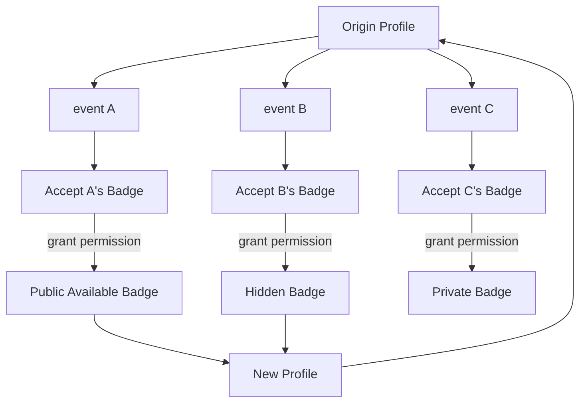
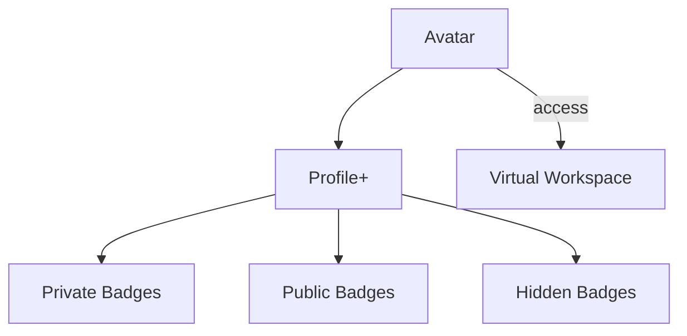

# Meta_Connect

## Intro
Meta_Connect values the connection among people and provides online features for you to interact with others through **Meta Tags**.

Especially at this particular time when people may not meet in person during the pandemic,
We don't want to lose touch with our friends and colleagues.

***Let's connect!***

## What is a Meta Tag
Engineers used to provide some personal info to customize their online profile like work group, the event experience and their interests.

With one identity in the Metaverse, **Meta Tag will save you from editing and maintaining multiple profiles.**

## How the project works

Inspired by Steam Achievement Tracking, Meta_Connect helps you **collect badges in a simple way**.

Moreover, your **virtual avatar** can carry the souvenir and have fun in the **virtual workspace**, meeting with new friends.
